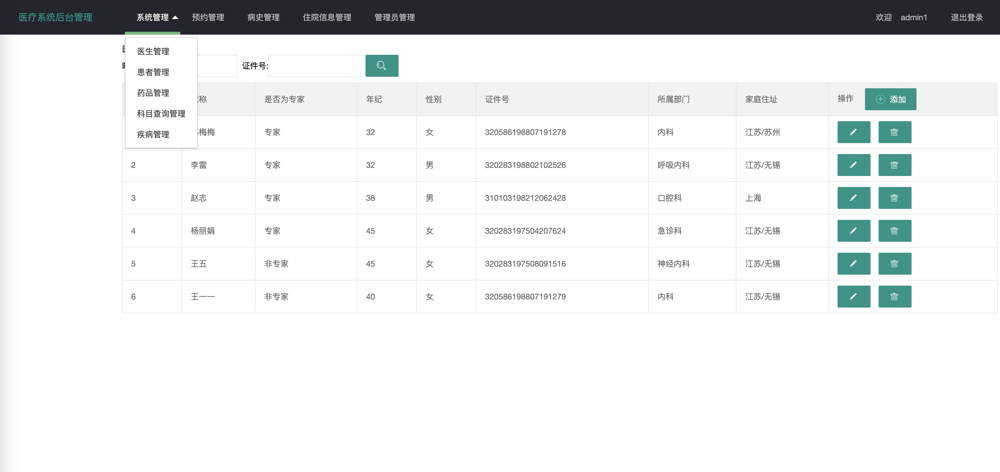
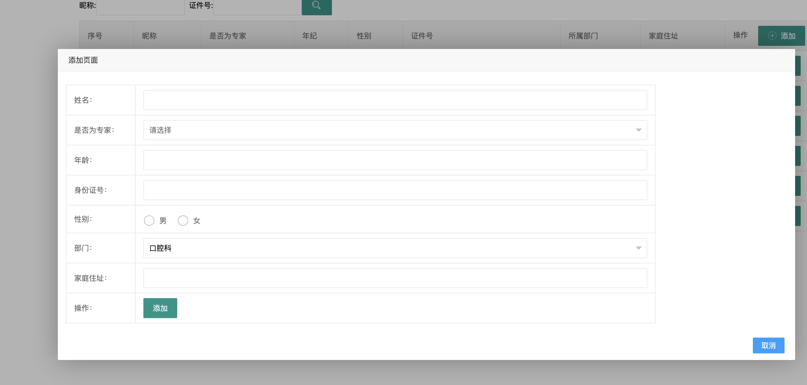
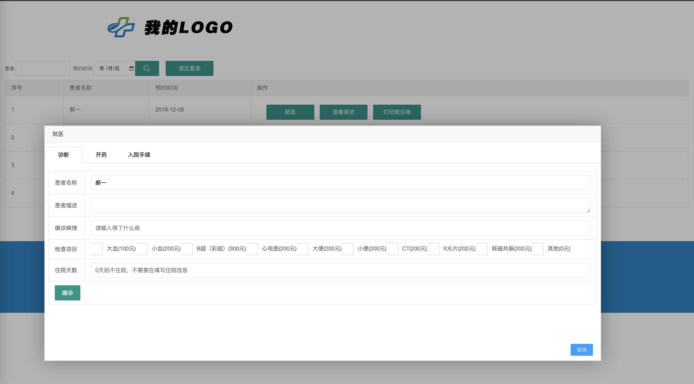
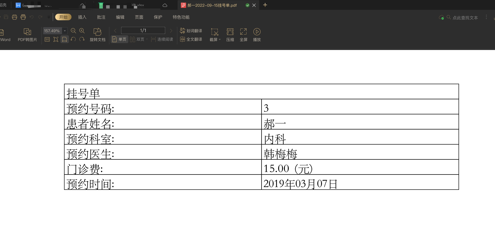
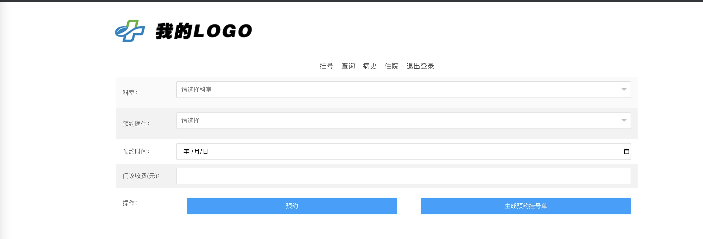
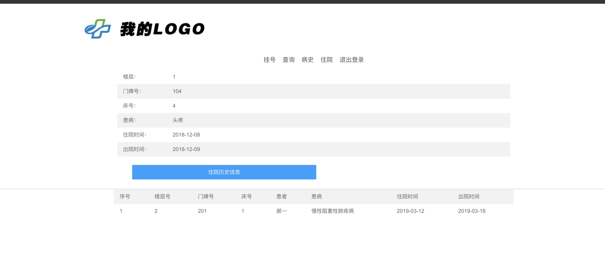
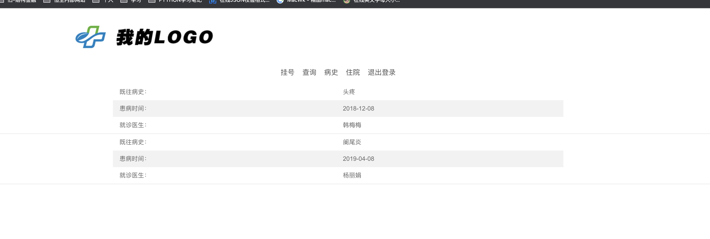

# Hospital
医疗信息管理系统（ssm+layui+freemaker）
## docker 创建mysql schema
docker run --name mysql -e MYSQL_ROOT_PASSWORD=123456 -d -i -p 3306:3306 mysql:latest
MYSQL_ROOT_PASSWORD=123456 意味着账号是root，密码是123456
## 执行sql文件 
Hospital/sql/hospital.sql
## 关于gen.xml
Hospital/src/main/java/com/hospital/uitls/MybatisGen.java 这个类执行可以生成初始化的mybatis的xml
## 系统截图

